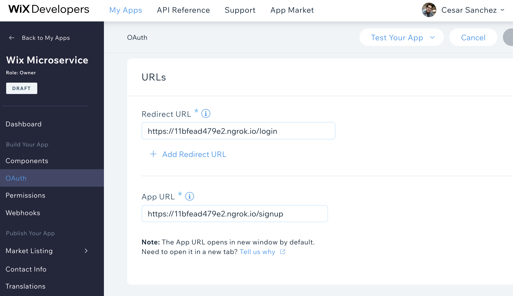

# Wix Microservice

This microservice has only the purpose of installing wix application in user's site and getting the authorization code.
Once the authorization code is received it can be stored and used in other services and for subsequent tranasactions.

# Demo


# Instructions
For a quick setup you can use [ngrok](https://ngrok.com/) so it's not necessary to deply an instance of this microservice. Download and run ngrok:

```sh
❯ ./ngrok http 3000
```

Go to your [Wix App](https://dev.wix.com/dc3/my-apps/) OAuth section and copy your APP-ID and App-Secrete Keys and paste them in a `.env` file in this project at root level. See `.env.example` for reference. In the same Wix page paste your **ngrok** url like this:
 - Redirect URL: {ngrok_url}/login
 - App URL: {ngrok_url}/signup



### Install Dependencies and Kick Off the Service

```sh
yarn && yarn dev
```

That's it! Now you can test intsalling the app in your site.
